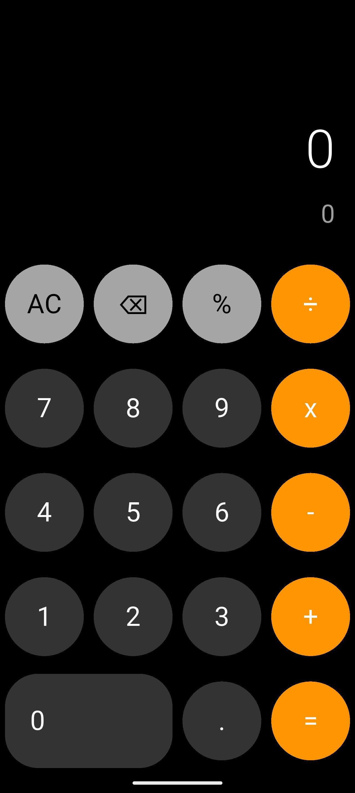
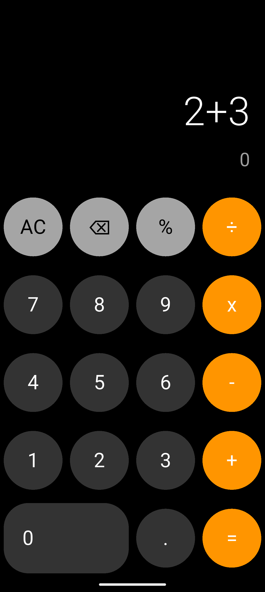

# 📱 iOS Calculator Clone

A pixel-perfect replication of the native iOS Calculator application built using **Flutter**. This project demonstrates advanced UI design capabilities, state management for complex calculations, and attention to detail in mimicking native behaviors like button highlights and text scaling.

---

### 📸 App Screenshots

| **Standard View** | **Calculation Result** | **Active/Clear State** |
|:---:|:---:|:---:|
|  |  |  |
| *Clean, Native UI Replication* | *Handling Operations & Results* | *State Changes (e.g., 'AC' to 'C')* |

---

### 🛠️ Tech Stack

*  **Flutter Framework**
*  **Dart Language**
* **`math_expressions` Package** (Optional, if used for parsing) - For evaluating mathematical strings.

---

### ✨ Key Features

* **Pixel-Perfect Design:** Faithful recreation of the iOS calculator's layout, colors, and typography.
* **Dynamic Button Styling:** Operator buttons ( like ÷, ×, -, +) change color to indicate the active operation, just like the native app.
* **Smart Text Scaling:** The display text automatically resizes to fit large numbers, preventing overflow.
* **Complex Logic Handling:** Correctly processes order of operations (BODMAS/PEMDAS), decimal points, and percentage calculations.
* **Responsive Layout:** Adapts flawlessly to different screen sizes and orientations.

---

### 🚀 How to Run Locally

1.  **Clone the repository**
    ```bash
    git clone [https://github.com/saadullah-001/IOS-Calculator.git](https://github.com/saadullah-001/IOS-Calculator.git)
    ```

2.  **Navigate to the project directory**
    ```bash
    cd ios-calculator-clone
    ```

3.  **Install dependencies**
    ```bash
    flutter pub get
    ```

4.  **Run the app**
    ```bash
    flutter run
    ```

---

### 👤 Author

**Muhammad SaadUllah**
- [GitHub Profile](https://github.com/saadullah-001)
- [LinkedIn Profile](www.linkedin.com/in/saad-ullah001)
